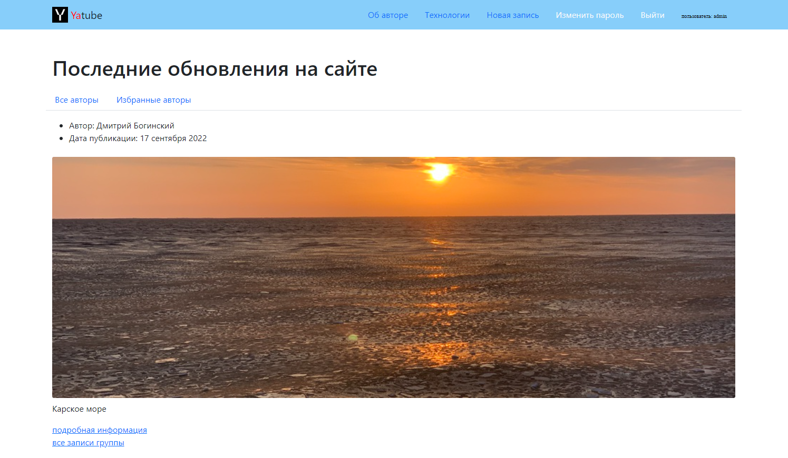

# Социальная сеть «Yatube»

### Описание
Платформа для публикации контента с авторизацией, персональными лентами, с комментариями и подпиской на авторов. В проекте используется пагинация постов и кеширование. Регистрация реализована с верификацией данных, сменой и восстановлением пароля через почту. Написаны тесты, проверяющие работу сервиса.

### Технологии
* Python 3.7
* Django 2.2.16
* Pillow 8.3.1
* sorl-thumbnail 12.7.0
* django-debug-toolbar 3.2

### Запуск проекта в dev режиме на Linux
Клонировать проект c GitHub
```
git clone git@github.com:boginskiy/Yatube.git
```
Установить виртуальное окружение venv
```
python3 -m venv venv
```
Активировать виртуальное окружение venv
```
source venv/bin/activate
```
Установить зависимости из файла requirements.txt
```
pip install -r requirements.txt
```
Выполнить миграции
```
python3 manage.py makemigrations
python3 manage.py migrate
```
Создание суперпользователя
```
python3 manage.py createsuperuser
```
Запуск
```
python3 manage.py runserver
```

### **Интерфейс**



### **Автор**
[Богинский Дмитрий](https://github.com/boginskiy) - python разработчик
